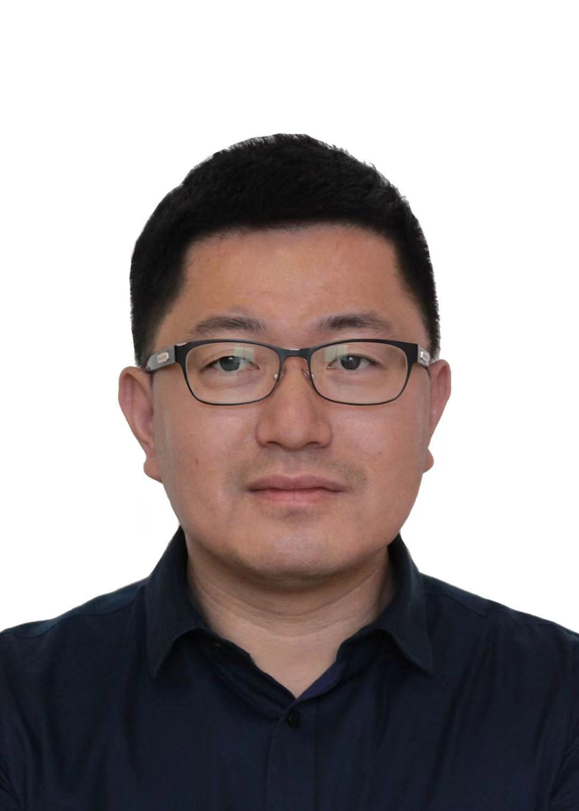

<!-- 
工程伦理（Engineering Ethics）

2023年秋季

周二11-14节 玉泉曹光彪西楼-202
 -->
---

## 教学团队

授课老师：[朱  强](https://person.zju.edu.cn/zhuq?ivk_sa=1025922p)  
邮箱地址：<zhuq@zju.edu.cn>

授课老师：孔  鸣  
邮箱地址：<zjukongming@zju.edu.cn>

教学助理：黄  靖  
邮箱地址：<huangjin9@zju.edu.cn>

---

## 课程简介

人工智能伦理探讨了在人工智能的发展和应用过程中应该遵循的原则、准则和规范，以确保人工智能的设计、实施和使用符合道德、社会和人权的要求。本课程主要涵盖以下重要内容：

1. 公正和公平：人工智能系统应该被设计和使用，以确保公正和公平对待所有人，避免歧视和不平等的出现。这包括避免偏见的数据和算法，以及确保公正的决策和结果。

2. 隐私和数据保护：人工智能系统应该尊重个人隐私和数据保护的原则。这意味着收集、存储和处理个人数据时需要获得合法的授权，并采取适当的安全措施来保护数据的机密性和完整性。

3. 透明度和可解释性：人工智能系统应该是透明和可解释的，以便用户和相关利益相关者能够理解其决策和行为的原因。这有助于建立信任，减少误解和不信任。

4. 责任和问责：人工智能系统的开发者和使用者应该承担责任，确保系统的正当使用和社会价值。他们应该对系统的行为负责，并能够解释和纠正系统可能带来的错误或伤害。

5. 社会影响和可持续性：人工智能系统的开发和应用应该考虑其对社会的影响，并追求可持续发展。这包括关注就业影响、社会公益、环境可持续性等方面，以确保人工智能的发展符合社会的整体利益。

## 课程安排

<table>
<thead>
  <tr>
    <th>周次</th>
    <th>日期</th>
    <th>时间</th>
    <th>授课</th>
    <th>内容</th>
  </tr>
</thead>
<tbody>
  <tr>
    <td rowspan="2">1</td>
    <td rowspan="2">9/18</td>
    <td>18:50—19:20</td>
    <td>朱强</td>
    <td>课程大纲及项目设计</td>
  </tr>
  <tr>
    <td>19:20—22:00</td>
    <td>朱强</td>
    <td>人工智能技术及伦理挑战 <a href="https://alidocs.dingtalk.com/i/nodes/ydxXB52LJq7loyGnUzrvKgNqWqjMp697?utm_scene=person_space">[slides]</a></td>
  </tr>
  <tr>
    <td rowspan="2">2</td>
    <td rowspan="2">9/26</td>
    <td>18:50—20:20</td>
    <td>孔鸣</td>
    <td>工程伦理基本概念（上）<a href="https://alidocs.dingtalk.com/i/nodes/EpGBa2Lm8azv5dwGsdNxrMOvWgN7R35y?utm_scene=person_space">[slides]</a></td>
  </tr>
  <tr>
    <td>20:30—22:00</td>
    <td>孔鸣</td>
    <td>工程伦理基本概念（下）<a href="https://alidocs.dingtalk.com/i/nodes/Gl6Pm2Db8D3mKkP4tdzxKQ54JxLq0Ee4?utm_scene=person_space">[slides]</a></td>
  </tr>
  <tr>
    <td rowspan="2">3</td>
    <td rowspan="2">10/10</td>
    <td>18:50—20:20</td>
    <td>孔鸣</td>
    <td>AIGC的价值观和伦理问题 <a href="https://alidocs.dingtalk.com/i/nodes/lyQod3RxJK3mjxPGtEwvNx3PJkb4Mw9r?utm_scene=person_space">[slides]</a></td>
  </tr>
  <tr>
    <td>20:30—22:00</td>
    <td></td>
    <td>论文研读</td>
  </tr>
  <tr>
    <td rowspan="2">4</td>
    <td rowspan="2">10/17</td>
    <td>18:50—20:20</td>
    <td>朱强</td>
    <td>人工智能的偏见和歧视：可解释AI</td>
  </tr>
  <tr>
    <td>20:30—22:00</td>
    <td></td>
    <td>论文研读</td>
  </tr>
  <tr>
    <td rowspan="2">5</td>
    <td rowspan="2">10/24</td>
    <td>18:50—20:20</td>
    <td>—</td>
    <td>人工智能头部企业专家报告（待邀请）<a href="#tips">[slides]</a></td>
  </tr>
  <tr>
    <td>20:30—22:00</td>
    <td></td>
    <td>论文研读</td>
  </tr>
  <tr>
    <td rowspan="2">6</td>
    <td rowspan="2">10/31</td>
    <td>18:50—20:20</td>
    <td>朱强</td>
    <td> 隐私保护技术：联邦学习和差分隐私 <a href="#tips">[slides]</a></td>
  </tr>
  <tr>
    <td>20:30—22:00</td>
    <td></td>
    <td>主题调研</td>
  </tr>
  <tr>
    <td rowspan="2">7</td>
    <td rowspan="2">11/7</td>
    <td>18:50—20:20</td>
    <td></td>
    <td>话题辩论</td>
  </tr>
  <tr>
    <td>20:30—22:00</td>
    <td></td>
    <td>话题辩论</td>
  </tr>
  <tr>
    <td rowspan="2">8</td>
    <td rowspan="2">11/14</td>
    <td>18:50—20:20</td>
    <td></td>
    <td>主题调研</td>
  </tr>
  <tr>
    <td>20:30—22:00</td>
    <td></td>
    <td>期末考试</td>
  </tr>
</tbody>
</table>

## 项目设计

课程项目以分组的形式进行，项目类别包括论文研读，主题调研和话题辩论。[组队&选题](https://alidocs.dingtalk.com/i/nodes/14lgGw3P8vvloyGRuP97XvYx85daZ90D?utm_scene=person_space)

- **论文研读：** 每组3人，共开放15组。选择一篇工程伦理相关的论文深入研读，然后用15分钟（10分钟PPT展示 + 5分钟问答）时间在课堂上向全班展示论文的内容，观点和自己的见解。

- **主题调研：** 每组6人，共开放12组。自行选择一个工程伦理相关的主题进行调研，并在课堂上用15分钟进行展示（需要具备相对落地的形式，比如问卷调查、视频制作、工具开发等）。

- **话题辩论：** 每组12人，每组分A，B两队，每队6人，共开放8组。从给定的话题中选取一个，并随机分配正反方立场，准备并进行一场20分钟的辩论，展示自己的论据和观点。

## 课堂考勤

- [打卡规则](https://alidocs.dingtalk.com/i/nodes/93NwLYZXWygloLKncdBXP3M5JkyEqBQm?utm_scene=person_space)

## 成绩评定

- 20% 课堂考勤

- 40% 项目设计

- 40% 期末考试成绩

- 10% 课堂参与（bonus）

## 参考书目

- 李正风，丛杭青，王前等. 工程伦理（第2版）.  清华大学出版社
- 古天龙 . 人工智能伦理导论.  高等教育出版社
